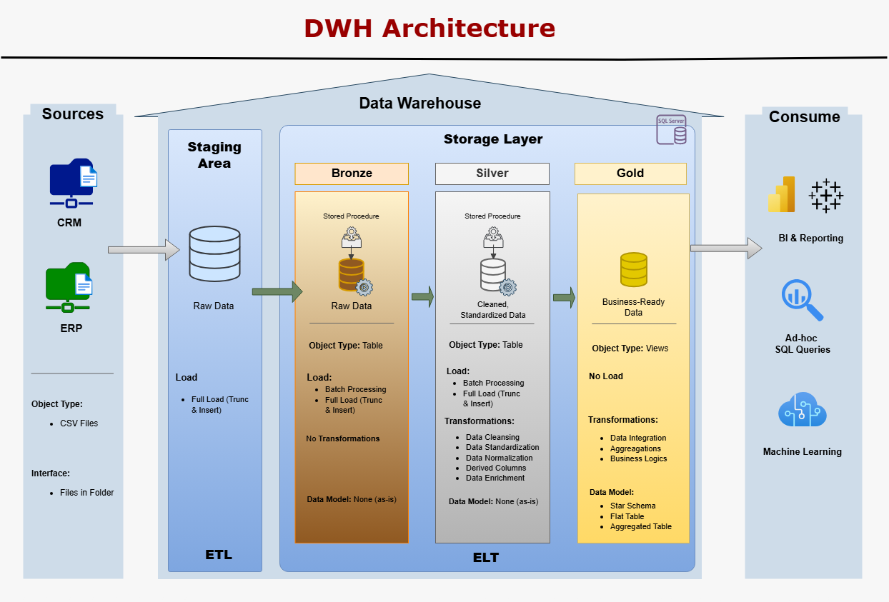

# Data Warehouse Project — CRM & ERP Integration (Medallion Architecture)

This repository contains an end-to-end **Data Warehouse implementation** designed to integrate CRM and ERP data into a unified analytical model.  
The project demonstrates practical skills across **data ingestion, data quality, modeling, SQL development, and analytical design**, following industry-standard Data Engineering and Analytics practices.

The final output is a **business-ready Star Schema** suitable for BI tools and analytical use cases, while preserving data lineage, auditability, and scalability.

---

## Project Description

The project follows a **Medallion Architecture (Bronze, Silver, Gold)** to progressively refine raw operational data into analytics-ready datasets:

- **Bronze Layer:** Raw ingestion with minimal transformation and full lineage tracking  
- **Silver Layer:** Data cleansing, normalization, validation, and integration  
- **Gold Layer:** Business-oriented dimensional modeling using a Star Schema  

Data originates from simulated **CRM and ERP systems** provided as CSV files. These heterogeneous sources are consolidated into a centralized SQL Server Data Warehouse using a structured ELT approach.

This project focuses on **backend analytical data preparation**, ensuring that downstream dashboards and analyses can be built on reliable, well-modeled data.

---

## Architecture Overview

The Data Warehouse is implemented using a layered architecture that ensures:

- Clear separation of responsibilities between layers  
- Reproducible full loads  
- Traceability from source files to analytical outputs  
- Ease of maintenance and future expansion  



---

## Key Technical Concepts Demonstrated

This project showcases competencies relevant to **Data Analyst, Analytics Engineer, and Data Engineering** roles:

- SQL-based ELT pipelines  
- Medallion (Bronze / Silver / Gold) architecture  
- Staging and controlled ingestion of raw data  
- Data cleansing, normalization, and standardization  
- Deduplication and business-rule validation  
- Audit tables for data quality issues  
- Slowly changing data handling (current-record filtering)  
- Dimensional modeling (Star Schema)  
- Surrogate key generation  
- Clear separation between operational and analytical models  
- Technical documentation and data cataloging  

---

## Gold Layer — Analytical Model

The Gold layer is modeled as a **Star Schema**, optimized for analytical queries and BI tools. It consists of:

- **fact_sales** — transactional sales data  
- **dim_customer** — integrated customer dimension (CRM + ERP)  
- **dim_product** — current product dimension with category enrichment  

This structure enables efficient slicing and aggregation by customer, product, and time.

---

## Repository Structure

```text
.
├── datasets/
│   ├── crm_cust_info.csv
│   ├── crm_prd_info.csv
│   ├── crm_sales_details.csv
│   ├── erp_cust_az12.csv
│   ├── erp_loc_a101.csv
│   └── erp_px_cat_g1v2.csv
│
├── scripts/
│   ├── 01_create_database_and_schemas.sql
│   ├── 02_control_schema_and_tables.sql
│   ├── 03_bronze_layer_creation.sql
│   ├── 04_create_staging_tables.sql
│   ├── 05_load_bronze.sql
│   ├── 06_silver_layer_creation.sql
│   ├── 07_silver_layer_cleansing.sql
│   ├── 08_silver_layer_load.sql
│   ├── 09_gold_layer_checks.sql
│   └── 10_gold_layer_creation.sql
│
├── documents/
│   ├── drawio/
│   │   ├── DWHArchitecture.drawio
│   │   ├── DataFlowDiagram.drawio
│   │   ├── IntegrationModel.drawio
│   │   └── Star_Schema.drawio
│   │
│   ├── images/
│   │   ├── architecture.png
│   │   ├── data_flow.png
│   │   ├── integration_model.png
│   │   └── star_schema.png
│   │
│   ├── REPORT.pdf
│   ├── REPORT.md
│   ├── DATA_CATALOG.pdf
│   └── DATA_CATALOG.md
│
└── README.md
```

## Documentation

This project is fully documented:

- REPORT.pdf / REPORT.md
  
    A detailed, portfolio-ready technical report explaining:

    - Architecture decisions
    - Data ingestion and transformation logic
    - Layer responsibilities
    - Dimensional modeling choices
    - Data quality handling

- DATA_CATALOG.pdf / DATA_CATALOG.md
  
A structured data catalog describing all Gold-layer tables and columns.

## Conclusion

This project demonstrates my ability to **design, implement, and document a complete analytical data pipeline**, from raw source files to a clean, business-ready analytical model.
It reflects strong foundations in SQL, data modeling, data quality management, and architectural thinking, with a clear focus on enabling reliable analytics and decision-making.

The Gold layer produced here is ready to be consumed by BI tools and will serve as the foundation for future dashboards and analytical explorations.

---

## UPDATE – Dashboard Analysis

As a final step, the Gold layer of the data warehouse was exported to CSV and loaded into Tableau Public to build an executive-level analytical dashboard. The dashboard is based on the analytical star schema and enables interactive exploration of sales performance, customer demographics, and product behavior.

The design emphasizes business logic correctness (e.g., distinct order counting, surrogate keys, and filter-aware KPIs), data quality transparency, and full cross-filter interactivity, allowing users to drill into specific countries, customer segments, products, and time periods.

### Interactive Dashboard

<iframe
  src="https://public.tableau.com/views/Dashboard_Analysis_17665628831500/Dashboard?:language=en-US&:display_count=n&:origin=viz_share_link"
  width="100%"
  height="800"
  frameborder="0">
</iframe>


This step completes the end-to-end flow from raw data ingestion to decision-ready analytics.


---

## Acknowledgements

This project was inspired in part by a tutorial from Baraa through his YouTube channel [Data with Baraa](https://www.youtube.com/@DataWithBaraa)
. His channel is great, you should check it!

While the overall structure follows similar principles, the implementation, design decisions, extensions, and documentation were independently developed and expanded to reflect my own learning objectives and analytical focus.

---

## 💬 Feedback & Contributions
This project is part of my ongoing learning and portfolio development.  
Feel free to open issues, suggest improvements, or share feedback.

Thanks for stopping by! 
