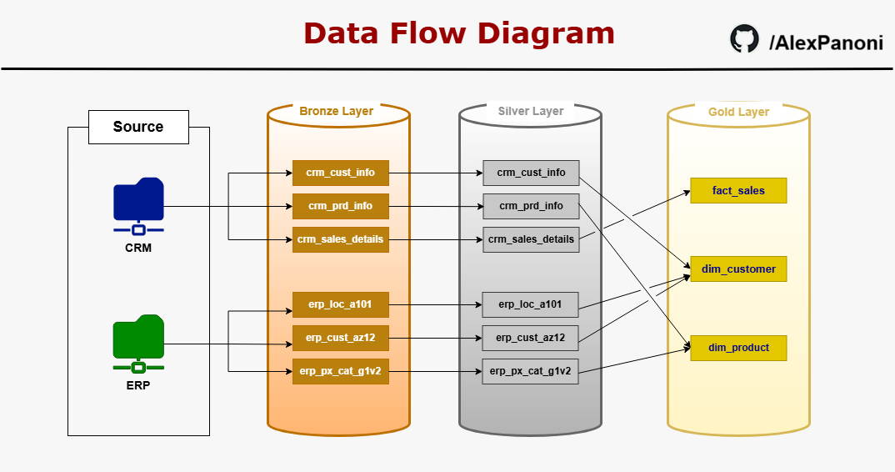
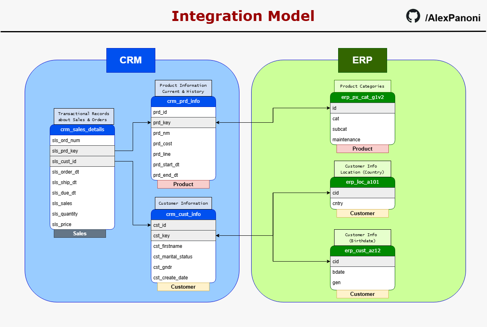
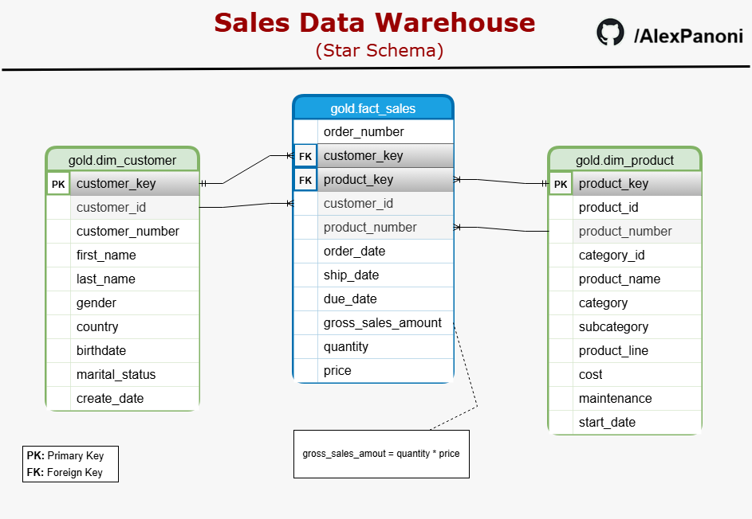

# 1. Executive Summary

This project presents the design and implementation of an end-to-end analytical Data Warehouse built to consolidate, cleanse, and model operational data into a business-ready format. The objective was to simulate a real-world enterprise data pipeline, demonstrating strong data engineering fundamentals, data modeling skills, and analytical thinking suitable for decision support.

The solution follows a layered Data Warehouse architecture, comprising a **Staging Area** and the **Bronze**, **Silver**, and **Gold layers**. Raw data sourced from multiple CSV files representing CRM and ERP systems was first ingested into staging tables to enable controlled, repeatable bulk loading. From there, data was progressively refined across layers, applying systematic data quality checks, cleansing rules, normalization, and enrichment logic.

In the **Bronze layer**, data was ingested with minimal transformation, preserving raw values while ensuring traceability through lineage metadata. The **Silver layer** focused on data standardization, type enforcement, deduplication, referential validation, and business rule application. Audit mechanisms were implemented to identify and document data quality issues without interrupting the pipeline. All Silver layer loads were executed using full-load procedures to ensure consistency and idempotency.

The **Gold layer** represents the analytical presentation layer, designed using a **Star Schema**. A central fact table captures sales transactions, while dimension tables provide conformed customer and product attributes. Historical product versions were handled explicitly, and surrogate keys were introduced to support analytical joins and future scalability. This layer was implemented using SQL views, emphasizing data integration, semantic clarity, and analytical usability rather than data movement.

The final output delivers a clean, well-documented analytical model suitable for BI tools and ad-hoc analysis. The project demonstrates proficiency in SQL, Data Warehousing concepts, data modeling, data quality management, and architectural design, reflecting real-world practices commonly found in modern analytics and data engineering environments.

# 2. Project Overview

## Objective

The objective of this project is to design and implement a complete analytical Data Warehouse that transforms raw operational data into a structured, reliable, and business-ready analytical model. The project aims to demonstrate practical skills in data engineering, data modeling, and SQL-based data transformation, following industry-standard architectural patterns.

Beyond technical implementation, the project emphasizes data quality management, auditability, and clear separation of concerns across layers, ensuring that analytical outputs are trustworthy and easy to consume by downstream users such as analysts, data scientists, and BI tools.

## Scope

The scope of the project includes the full lifecycle of analytical data preparation:

- Ingestion of raw CSV files originating from simulated CRM and ERP systems
- Design and implementation of a layered Data Warehouse architecture
- Data cleansing, normalization, deduplication, and validation
- Integration of heterogeneous data sources into conformed dimensions
- Construction of an analytical Star Schema
- Documentation through data flow diagrams, schema diagrams, and a data catalog

The project primarily focuses on backend data engineering and analytical modeling activities, with the objective of producing a reliable, business-ready Gold layer. This curated layer is explicitly designed to serve as a foundation for downstream analytical use cases, such as dashboards, reports, and advanced analysis. While visualization and dashboard development are not implemented within the scope of this report, the final data model fully supports their creation as a natural next step.

## Technologies and Tools

The project was implemented using the following technologies and tools:

  - **Database**: Microsoft SQL Server (Express Edition)
  - **Query Language**: T-SQL
  - **Modeling Approach**: Medallion Architecture (Bronze, Silver, Gold)
  - **Data Modeling**: Star Schema
  - **Diagramming**: Draw.io (Data Flow, Integration Model, Star Schema)
  - **Documentation**: LaTeX (Overleaf), Markdown (GitHub)
    

All transformations were implemented directly in SQL to reflect real-world scenarios where data processing is performed inside the database engine.

## Data Sources

The data used in this project consists of multiple CSV files representing operational data from two primary domains:

  - **CRM data**: customer information, product details, and sales transactions
  - **ERP data**: customer demographics, location data, and product category metadata

These datasets were intentionally heterogeneous and imperfect, containing inconsistencies, missing values, formatting issues, and historical records, allowing the project to realistically demonstrate data quality challenges and resolution strategies.

## Design Principles

Throughout the project, the following design principles were applied:

  - Clear separation of responsibilities across layers
  - Preservation of raw data before transformation
  - Explicit handling of data quality issues
  - Reproducible and idempotent data loads
  - Analytical usability as the final objective

These principles guided architectural decisions and ensured the final solution aligns with best practices commonly adopted in enterprise analytics environments.

## Visual Documentation

To support clarity and communication, the following diagrams were created using Draw.io and included in the project documentation:

  - Data Warehouse Architecture
  - Data Flow Diagram
  - Integration Model
  - Star Schema Diagram

These visuals complement the written documentation and provide an at-a-glance understanding of the system design.

---

# 3. Data Sources Overview

This project is based on structured data originating from multiple operational systems, representing typical enterprise data fragmentation across different business domains. The datasets were provided as CSV files and simulate data extracted from both CRM and ERP systems, each with its own structure, conventions, and level of data quality.

The primary data sources can be grouped into three categories:

## Customer Data Sources
Customer-related information originates from three distinct datasets:

- **CRM Customer Information (`crm_cust_info`)**  
  Contains core customer identifiers and attributes such as customer ID, customer key, first and last names, marital status, gender, and customer creation date. This table serves as the primary and authoritative source for customer records.

- **ERP Customer Attributes (`erp_cust_az12`)**  
  Provides supplementary customer details, including birth date and an alternative representation of gender. This dataset was used to enrich customer profiles and resolve missing or ambiguous attributes.

- **ERP Customer Location (`erp_loc_a101`)**  
  Contains geographic information related to customers, specifically country-level location data. This information was later integrated directly into the customer dimension.

## Product Data Sources
Product-related data is distributed across two datasets:

- **CRM Product Information (`crm_prd_info`)**  
  Includes product identifiers, product keys, product names, product line classifications, costs, and validity periods (start and end dates). This dataset contains historical versions of products, reflecting changes over time.

- **ERP Product Categories (`erp_px_cat_g1v2`)**  
  Stores product category and subcategory descriptions, along with a maintenance indicator. This dataset was used to enrich product records with business-friendly categorical information.

## Sales Transaction Data
- **CRM Sales Details (`crm_sales_details`)**  
  Contains transactional sales data, including order numbers, customer and product identifiers, order, shipping and due dates, quantities, prices, and total sales amounts. This table represents the core business events and later became the basis for the fact table in the analytical model.

Overall, these datasets reflect a realistic enterprise scenario in which data must be consolidated, cleansed, standardized, and integrated before it can support analytical and reporting use cases. The diversity of sources and schemas provided a solid foundation for implementing a layered data warehouse architecture and applying data engineering best practices.

---

# 4. Data Architecture and Methodology

## Architectural Approach

This project follows a modern analytical data warehouse architecture based on layered data processing and clear separation of concerns. The design emphasizes data quality, traceability, and scalability, while remaining simple enough to be easily understood and maintained.

The architecture is organized into four main areas:

- **Staging Area**
- **Bronze Layer (Raw)**
- **Silver Layer (Cleansed)**
- **Gold Layer (Business-Ready)**

Each layer has a well-defined responsibility and enforces progressively stronger data quality and business rules.

---

 

*Figure 1 – Data Warehouse architecture illustrating the Staging, Bronze, Silver, and Gold layers.*

---

## Staging Area

The staging area is used as a transient landing zone for raw CSV files. Data is bulk-loaded from the file system into staging tables with minimal transformation.

The purpose of the staging area is to:

- Isolate file-level ingestion from business tables  
- Simplify debugging and reprocessing  
- Provide a controlled entry point for raw data  
- Decouple file formats from the Bronze layer schema  

No data cleansing or business logic is applied at this stage.

## Bronze Layer (Raw Data)

The Bronze layer stores raw data in a structured, relational format that closely mirrors the source systems. Columns are stored primarily as text (`NVARCHAR`) to avoid data loss during ingestion.

Key characteristics of the Bronze layer:

- One-to-one representation of source datasets  
- Full-load strategy with `TRUNCATE + INSERT`  
- Lineage metadata included for traceability:
  - Load identifier
  - Source file name
  - Load timestamp
- Minimal transformation logic  

The Bronze layer serves as the immutable historical foundation of the warehouse.

## Silver Layer (Cleansed and Standardized Data)

The Silver layer is responsible for enforcing data quality and preparing the data for analytical use. This is where most of the transformation logic is applied.

Key activities performed in this layer include:

- Data type conversion (e.g., text to dates and numerics)
- Standardization of categorical values (e.g., gender, country)
- Deduplication using window functions
- Handling of invalid, missing, or out-of-bound values
- Data enrichment and normalization
- Audit tables to capture anomalous records without losing corrected data

All Silver layer loads are implemented using a full-load strategy and consolidated into a single stored procedure to ensure consistency and repeatability.

---

## Gold Layer (Business and Analytics Layer)

The Gold layer represents the final, business-ready data model. It is designed to support reporting, analytics, and downstream BI tools.

Key design principles of the Gold layer:

- Star schema modeling
- Clear separation between fact and dimension tables
- Surrogate keys for analytical joins
- Business logic applied at the semantic level
- Implemented using SQL Views rather than physical tables

The Gold layer integrates data from multiple Silver tables, applies business rules, and exposes a clean and intuitive model for end users.

## Data Modeling Strategy

The final model follows a **star schema** consisting of:

- **Fact table**:
  - `fact_sales`: transactional sales data

- **Dimension tables**:
  - `dim_customer`: integrated customer attributes
  - `dim_product`: current-state product attributes

This approach ensures:

- Simpler queries
- Better performance
- Clear analytical semantics
- Compatibility with BI tools

---

## End-to-End Data Flow

To complement the architectural view presented earlier, this section introduces the end-to-end data flow of the project, illustrating how data moves across layers and how source tables evolve throughout the pipeline.

*Figure 2* provides a consolidated view of the data lifecycle, starting from the raw data sources and progressing through the Bronze, Silver, and Gold layers. The diagram highlights the separation between CRM and ERP source systems, the initial landing of data into the Bronze layer, the one-to-one propagation of tables into the Silver layer for cleansing and standardization, and the final transformation into analytically optimized structures in the Gold layer.

This representation serves as a conceptual roadmap for the technical sections that follow. While subsequent sections describe each layer in detail, the data flow diagram offers a high-level understanding of how ingestion, transformation, integration, and modeling steps are orchestrated within the overall ELT pipeline.

---

 

*Figure 2 – End-to-end data flow from source systems through the Bronze, Silver, and Gold layers.*

---

# 5. Data Ingestion and Staging Layer

The first operational step of the data warehouse pipeline is the ingestion of raw data from external files into a controlled database environment. In this project, all source datasets were provided as CSV files and represent extracts from heterogeneous operational systems. To ensure reliability, traceability, and reusability of the ingestion process, a dedicated staging layer was implemented prior to loading data into the Bronze layer.

## Purpose of the Staging Layer

The staging layer serves as a transient storage area designed exclusively for raw data ingestion. Its primary purpose is to isolate file-level ingestion concerns from downstream transformation logic. By introducing this intermediate step, the project achieves the following objectives:

- Decoupling file ingestion logic from business and data quality transformations.
- Allowing validation of raw data before it is persisted into the Bronze layer.
- Providing a controlled environment for troubleshooting ingestion errors without impacting curated layers.
- Supporting full reloads and repeatable executions of the ingestion process.

The staging tables were designed to closely mirror the structure of the incoming CSV files, with minimal or no transformation applied at this stage.

## Ingestion Strategy

Data ingestion was implemented using a database-level procedure responsible for loading CSV files into the staging tables and subsequently transferring the data into the Bronze layer. This approach ensures consistency, automation, and reusability.

Key characteristics of the ingestion strategy include:

- **Full-load approach**: Each execution truncates staging and Bronze tables before inserting fresh data, guaranteeing idempotent loads and preventing duplicate records.
- **Schema preservation**: Data types and column structures in staging tables reflect the raw source files to avoid premature transformations.
- **Operational separation**: File ingestion logic is fully encapsulated within a dedicated stored procedure, enabling a single execution point for the entire ingestion process.

## Lineage and Metadata Capture

During ingestion, additional metadata columns were appended to all records and propagated through the Bronze and Silver layers. These columns include:

   - Load identifier, enabling traceability across pipeline executions.
   - Source file name, supporting auditing and data provenance analysis.
   - File reception timestamp, indicating when the data entered the warehouse.

This metadata provides end-to-end lineage visibility and supports operational monitoring, debugging, and governance requirements.

## Outcome

At the end of the ingestion process, all raw data is safely stored in the Bronze layer, faithfully representing the source systems while remaining fully traceable. This establishes a reliable foundation for systematic cleansing, validation, and integration in the Silver layer.

---

# 6. Bronze Layer – Raw Data Preservation

The Bronze layer represents the first persistent layer of the Data Warehouse and is responsible for storing raw data ingested from source systems in a structured, queryable format. While staging tables are used as a transient mechanism during ingestion, the Bronze layer acts as the **system of record for raw data** within the warehouse.

In this project, the staging process and the Bronze load are executed as part of the same ingestion workflow and are orchestrated by a single stored procedure.

## Purpose of the Bronze Layer

The primary objectives of the Bronze layer are:

- Preserve source data with minimal transformation  
- Maintain a faithful representation of the original files  
- Enable reproducibility and reprocessing of downstream layers  
- Provide full lineage and traceability for all records  

No business rules, data corrections, or semantic transformations are applied at this stage.

## Data Handling Principles

The Bronze layer follows a **load-as-is** philosophy, with only essential technical handling applied:

- Raw values are retained exactly as received from the source files  
- Data types are kept permissive (often text-based) to avoid ingestion failures  
- All source columns are stored using `NVARCHAR` data types, deferring type enforcement to the Silver layer  
- No deduplication, normalization, or validation logic is applied  
- All records are loaded, regardless of quality issues  

This approach ensures that data quality problems are not hidden or implicitly corrected before they can be properly assessed and addressed in later layers.

## Lineage Metadata

Each Bronze table includes technical metadata columns to support auditing and traceability:

- Load identifier  
- Source file name  
- Ingestion timestamp  

These attributes allow any record in the warehouse to be traced back to its originating file and load execution, which is essential for debugging, validation, and data governance.

## Load Orchestration

The entire Bronze ingestion process is encapsulated in a stored procedure. This procedure performs the following actions:

1. Loads raw CSV data into staging tables  
2. Transfers data from staging tables into Bronze tables  
3. Attaches lineage metadata to each record  

The use of a stored procedure provides a consistent, repeatable, and atomic execution model. Each run represents a complete refresh of the Bronze layer, aligning with the project’s full-load ingestion strategy.

## Outcome

At the conclusion of the Bronze load process, the Data Warehouse contains a complete, traceable, and unaltered snapshot of all source data. This establishes a reliable baseline from which systematic data cleansing, validation, and integration can be performed in the Silver layer.

---

# 7. Silver Layer – Data Cleansing and Standardization

The Silver layer represents the transformation and data quality enforcement stage of the Data Warehouse. In this layer, raw data from the Bronze layer is cleansed, standardized, validated, and prepared for analytical use, while still preserving a granular, record-level structure.

Unlike the Bronze layer, where data is ingested with minimal intervention, the Silver layer applies explicit business rules and data governance logic to ensure consistency, correctness, and analytical reliability.

## Objectives of the Silver Layer

The Silver layer was designed with the following objectives:

- Enforce data quality through validation and cleansing rules  
- Standardize formats, naming conventions, and categorical values  
- Resolve duplicates and invalid records using deterministic logic  
- Normalize data types for analytical correctness  
- Preserve data lineage and auditability  
- Maintain a full-load, idempotent processing strategy  

## Key Transformations and Controls

Across all datasets, the following transformations and controls were applied as appropriate:

- **Data type normalization**  
  - Conversion of textual date fields into proper `DATE` types  
  - Casting of numeric fields (prices, quantities, sales) into numeric data types  

- **Standardization and normalization**  
  - Trimming of whitespace and normalization of textual values  
  - Harmonization of categorical fields (e.g., gender, marital status, country names)  
  - Consistent handling of unknown or missing values  

- **Data validation and correction**  
  - Detection and handling of invalid or out-of-range dates  
  - Correction of negative or inconsistent numeric values when business logic allowed  
  - Validation of referential integrity across related datasets  

- **Deduplication logic**  
  - Use of window functions to identify and retain the most recent valid records  
  - Removal of duplicate business keys while preserving historical correctness  

- **Data enrichment**  
  - Derivation of additional attributes when required to support downstream modeling  
  - Resolution of inconsistencies across multiple source systems  

## Audit and Data Quality Tracking

To ensure transparency and traceability, audit tables were created for each dataset processed in the Silver layer. These tables capture records that violate defined data quality rules, such as:

- Invalid or malformed dates  
- Referential integrity mismatches  
- Unexpected or nonconforming values  

This approach allows problematic records to be analyzed without blocking the pipeline, while still enabling corrected data to flow into the Silver tables.

## Processing Strategy

The Silver layer is implemented using a **full-load strategy**, where target tables are truncated and fully reloaded on each execution. This guarantees idempotency and ensures consistent results across multiple runs.

All Silver-layer transformations are executed through a centralized stored procedure, enabling the entire layer to be rebuilt reliably with a single execution command.

## Role of the Silver Layer in the Architecture

The Silver layer serves as the **trusted analytical foundation** of the Data Warehouse. By enforcing data quality and consistency at this stage, it ensures that downstream models in the Gold layer can focus exclusively on business logic, aggregation, and analytical use cases without reapplying cleansing rules.

## Source Data Integration Model

After the completion of the Silver layer processing, the data reaches a state in which all source tables are fully cleansed, standardized, and structurally consistent, while still preserving their original operational granularity. At this stage, it becomes possible to clearly visualize how entities originating from different source systems relate to one another.

The figure below presents the **Source Data Integration Model** of the project. The diagram consolidates all tables derived from the original CSV files, as they appear in the Bronze and Silver layers, including their full column structures. Tables are visually grouped and color-coded to distinguish between CRM and ERP source systems, while arrows indicate the business keys and reference columns used to establish relationships across datasets.

This integration model serves as an explicit representation of the relational data landscape prior to analytical transformation. It highlights how customer, product, and transactional entities are connected at the operational level, and it provides the structural foundation for subsequent integration decisions. In particular, the model directly informs the design of conformed dimensions, the resolution of shared business keys, and the identification of attributes to be propagated into the analytical layer.

It is important to note that this model does not represent the final analytical schema. Instead, it captures the post-cleansing, pre-aggregation view of the data, reflecting how information exists after quality enforcement but before it is reshaped into business-oriented abstractions. The Gold layer builds upon this integrated structure, applying business rules, surrogate keys, and dimensional modeling principles to support efficient analytical querying.

 

*Figure 3 – Source Data Integration Model illustrating cleaned CRM and ERP tables, their attributes, and key-based relationships following Silver layer processing.*

# 8. Gold Layer

The Gold layer represents the analytical and business-facing layer of the Data Warehouse. Its primary purpose is to expose clean, integrated, and business-ready datasets that can be directly consumed by analytical tools, dashboards, and downstream data science workflows.

Unlike the Bronze and Silver layers, which focus on ingestion, cleansing, and standardization, the Gold layer is concerned with **data modeling, integration, and business logic**. All objects in this layer are created as **SQL views**, reflecting its role as a semantic layer rather than a physical storage layer.

## Modeling Approach

A **Star Schema** was adopted for the Gold layer, following dimensional modeling best practices. This approach simplifies analytical queries, improves performance, and provides a structure that is intuitive for business users.

The model consists of:
- One **fact table**, representing transactional sales data
- Two **dimension tables**, representing customers and products

This design enables flexible slicing and aggregation of sales metrics across customer and product attributes.

---

## Dimension: Customer (`dim_customer`)

The customer dimension consolidates customer-related data originating from both CRM and ERP systems. Three Silver-layer tables were integrated to form this dimension:
- Customer master data
- Demographic attributes
- Geographic information

Business rules were applied to resolve data conflicts, particularly for gender attributes, by defining a master source and fallback logic. A surrogate key was generated using a window function to provide a stable and warehouse-managed identifier.

This dimension provides descriptive attributes used to analyze customer behavior and segment sales performance.

---

## Dimension: Product (`dim_product`)

The product dimension integrates product master data with category and maintenance information. The source data contains historical versions of products, reflecting changes over time.

To maintain a clean and unambiguous analytical model, only the **current version of each product** was retained in the final dimension. Historical records were filtered out based on end-date logic.

This design choice ensures:
- A one-to-one relationship between products and surrogate keys
- Simpler joins with the fact table
- Clear and consistent analytical results

---

## Fact: Sales (`fact_sales`)

The sales fact table is built from transactional sales data and represents the central table of the Star Schema. Each row corresponds to a sales transaction and includes measures such as quantity, unit price, and total sales amount.

The fact table references the customer and product dimensions using surrogate keys, ensuring referential integrity and enabling efficient analytical queries.

Business measures were kept atomic, allowing aggregation at different granularities depending on analytical needs.

---

## Star Schema Overview

The following diagram represents the final Star Schema of the Gold layer, showing the fact table and its relationships with the customer and product dimensions. This model represents the final analytical structure of the Data Warehouse and serves as the foundation for reporting, dashboarding, and advanced analytics.

*Figure 4 – Star Schema of the Gold Layer*

---

# 9. Analytical Readiness and Use Cases

With the completion of the Gold layer, the Data Warehouse reaches a state of full analytical readiness. The data is now cleansed, integrated, and structured according to dimensional modeling best practices, enabling efficient exploration, reporting, and advanced analysis.

The final Star Schema, composed of a centralized `fact_sales` table and the conformed dimensions `dim_customer` and `dim_product`, was designed to support a wide range of analytical use cases while maintaining simplicity and performance. The separation between facts and dimensions ensures clarity in metric definition and minimizes ambiguity during analysis.

From a business perspective, this model enables immediate support for key analytical questions, such as:

- Revenue, quantity sold, and average price analysis over time  
- Customer behavior analysis by demographics, country, and lifecycle stage  
- Product performance analysis by category, subcategory, and product line  
- Identification of top-performing customers and products  
- Trend analysis based on order, shipping, and due dates  

The Gold layer was intentionally designed to be directly consumable by Business Intelligence and analytics tools such as Power BI, Tableau, or similar platforms. Measures can be defined on top of the fact table, while dimensions provide rich contextual attributes for slicing and filtering the data.

Although dashboard development is not part of the current implementation, the structure and quality of the Gold layer allow this project to be naturally extended into a visualization and reporting phase. This makes the Data Warehouse suitable not only for descriptive analytics, but also as a foundation for exploratory analysis, forecasting, and more advanced data science workflows.

# 10. Conclusion and Future Work

This project demonstrates the end-to-end design and implementation of a modern analytical Data Warehouse, covering the full lifecycle from raw data ingestion to analytics-ready dimensional models. Through a layered architecture (Staging, Bronze, Silver, and Gold), the solution emphasizes data quality, traceability, and scalability while following industry best practices.

Key competencies demonstrated throughout the project include:

- Design of a structured Data Warehouse architecture using SQL Server  
- Implementation of ELT principles with clear separation of responsibilities by layer  
- Robust data cleansing, normalization, deduplication, and validation processes  
- Integration of heterogeneous CRM and ERP data sources  
- Dimensional modeling using a Star Schema optimized for analytics  
- Use of audit mechanisms, lineage tracking, and full-load strategies  
- Clear documentation through diagrams, data catalogs, and technical reporting  

The final Gold layer provides a clean and consistent analytical model that can be directly consumed by Business Intelligence tools or advanced analytics workflows. By abstracting complexity away from end users, the model enables reliable and efficient analysis while ensuring metric consistency.

## Future Work

While the current scope focuses on backend data preparation and modeling, several natural extensions can further enhance the project:

- Development of interactive dashboards using tools such as Power BI or Tableau, built directly on top of the Gold layer  
- Definition of business KPIs and reusable analytical measures  
- Incremental load strategies to complement the existing full-load approach  
- Expansion of dimensional models, such as introducing a dedicated location or date dimension  
- Application of advanced analytics or forecasting models using the curated data  

Overall, this project was designed not only as a technical exercise, but as a portfolio-ready demonstration of practical data engineering and analytical modeling skills. It reflects real-world scenarios and design decisions commonly faced in analytics-driven organizations, and it serves as a concrete representation of my approach to building reliable, well-documented analytical data solutions.

I hope you enjoyed it! :)

